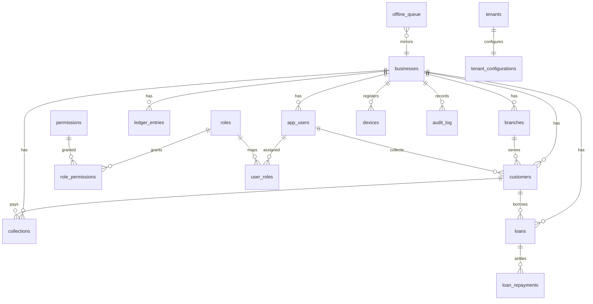

# Wave 2 — Database Platform

**Product:** SMILE TRUST SUSU MANAGEMENT SYSTEM  
**Wave:** WAVE-02 (MIB wave 4: DATABASE)  
**Status:** Gap closure + hardening delivered (EIR waveStatus remains **Mostly Complete** — production certification is WAVE-10)  
**Date:** 2026-09-15  
**Stack constraints:** Vanilla JS SPA · Capacitor/Electron · localStorage primary + optional Supabase · integer **pesewas** · interest **15** · collection days **31** · cashier GHS **1000** · no Next.js/Flutter · no new top-level nav · no greenfield schema rewrite

---

## 1. Purpose

Wave 2 **audits and hardens** the existing ECDAPS PostgreSQL surface (`supabase/migrations/001`–`043`, ~350 tables) rather than inventing a parallel schema. Deliverable is additive migration **044**, rollback script, seeds, RLS/RPC/view/index hardening, static tests, and this exit package.

**Posting authority:** In-process JS (`*-ops.js`) remains the primary money SoT for SPA/localStorage. SQL RPCs mirror the existing `record_collection_from_client` pattern for optional cloud SoT / sync. **No balance-update triggers** that would double-post against JS.

---

## 2. Gap analysis (existed vs added)

| Area | Before Wave 2 | Wave 2 action |
|------|---------------|---------------|
| Migrations 001–043 / ~350 tables | Present (ECDAPS) | Preserved; no rewrite |
| RPCs | ~14 helpers (ensure_*, record_collection, fetch_snapshot, …) | Added deposit/withdrawal/loan repay/EOD/cashbook/dashboard/sync/audit/offline enqueue |
| RLS | ~34 tables enabled; tenant policies on core money tables | Re-applied tenant policies; collector select; meta/offline/bcdr policies |
| Triggers | None | `updated_at` + soft master-data audit (no money) |
| Views | organizations, members, rule_published_catalog | + branch daily, customer balance, loan KPI, cashbook, dashboard KPI |
| Seeds | Partial (roles, CoA, tenant smile-trust) | Role↔permission maps, SUPER_ADMIN_FORBIDDEN, demo biz/branch/users/customer/product, money defaults |
| Rollback scripts | Absent | `supabase/rollbacks/044_wave2_database_platform.rollback.sql` |
| Migration ledger | `migration_history` (data exchange) only | + `schema_migration_log`, `wave2_platform_meta` |
| Offline queue cloud table | Missing (`sync_queue` / offline_* only) | + `offline_queue` |
| BCDR drill metadata | `recovery_tests` | + `bcdr_drill_log` |
| Docs / tests | ECDAPS Phase 7 | + `docs/wave2-database.md`, `tests/wave2-database.test.js` |

---

## 3. ERD (core business — mermaid)



Canonical inventory remains ECDAPS (`docs/enterprise-canonical-database-architecture.md`, `src/core/canonical-database-registry.js`).

---

## 4. Table dictionary (Wave 2 deltas)

| Table | Module | Purpose |
|-------|-------:|---------|
| `schema_migration_log` | 14 | Schema up/down apply ledger |
| `wave2_platform_meta` | 14 | Money defaults + wave status JSON |
| `offline_queue` | 15 | Cloud mirror of SPA offline queue metadata |
| `bcdr_drill_log` | 21 | Backup/DR drill evidence rows |

Money columns remain integer **pesewas** (`*_pesewas` / generated `amount_pesewas`). Defaults seeded: interest **15**, collection days **31**, cashier **100000** pesewas (GHS 1000).

---

## 5. RLS summary

- JWT helpers: `jwt_business_id`, `jwt_app_role`, `jwt_branch_id`, `jwt_is_elevated_role`, `policy_collector_customer_match`
- Tenant policies (`tenant_select/insert/update/delete`) on uuid `business_id` money/ops tables
- Collector-friendly customer select; elevated roles see full tenant
- `wave2_platform_meta` / `schema_migration_log` / `bcdr_drill_log` elevated or auditor read
- `offline_queue` authenticated with business_id text match (service role / null JWT allowed for lab sync)

---

## 6. RPC list (Wave 2 + existing core)

| RPC | Role |
|-----|------|
| `record_collection_from_client` | Existing — collection + ledger (005) |
| `upsert_customer_from_client` | Customer upsert |
| `record_deposit_from_client` | Deposit ledger (pesewas, idempotent) |
| `record_withdrawal_from_client` | Withdrawal ledger + cashier float guard |
| `record_loan_repayment_from_client` | Loan repayment row |
| `record_eod_snapshot` | EOD aggregate → `system_events` |
| `fetch_cashbook_summary` | Cashbook view JSON |
| `fetch_dashboard_kpis` | Ops KPI JSON |
| `ack_sync_queue_item` | Offline/sync ack |
| `enqueue_offline_item` | Offline queue upsert |
| `append_audit_event` | Audit append |
| `ensure_*` / `fetch_business_snapshot` / `import_snapshot_batch` | Existing 005 helpers |

---

## 7. Views & triggers

**Views:** `v_branch_collection_daily`, `v_customer_balance_summary`, `v_loan_portfolio_kpi`, `v_cashbook_daily`, `v_dashboard_ops_kpi`

**Triggers:** `tg_set_updated_at` on selected masters; `tg_audit_row_change` on `customers` / `branches` (metadata only — **not** balance posting).

---

## 8. Migration guide

1. Backup Supabase project (or local PG dump).
2. Ensure 001–043 already applied (ECDAPS).
3. Apply: `supabase/migrations/044_wave2_database_platform.sql` (SQL editor or `supabase db push` / `psql -f`).
4. Verify: `select * from wave2_platform_meta where key = 'wave2_status';`
5. Rollback (lab): `supabase/rollbacks/044_wave2_database_platform.rollback.sql`  
   Production: prefer restore from backup; rollback drops Wave-2-only objects and leaves additive indexes/policies on older tables.

### Live Supabase (optional)

CI does **not** require a live Postgres instance. To validate against Supabase:

```powershell
# After linking project
npx supabase db push
# or paste 044 into SQL editor
```

Static checks: `npm test` (includes `tests/wave2-database.test.js`).

---

## 9. Backup / BCDR notes

- Module 21 tables (`backup_*`, `recovery_tests`) unchanged.
- Wave 2 adds `bcdr_drill_log` for drill evidence; seed row `bcdr-seed-lab` is a planned lab placeholder.
- Rollback drill: apply 044 → run rollback SQL → confirm Wave-2 RPCs/views gone → re-apply 044 if needed.

---

## 10. Complete / Partial checklist

| # | Deliverable | Status | Pointers |
|---|-------------|--------|----------|
| 1 | DB foundation (schemas, extensions, naming, meta, migration framework) | **Complete** | `044` · `schema_migration_log` · `canonical_schema_meta` 2.0.0-wave2 |
| 2 | Core business tables | **Complete** (ECDAPS + deltas) | 001–043 + offline/offline/bcdr |
| 3 | Relationships PK/FK | **Complete** (additive) | existing FKs preserved; new tables keyed |
| 4 | Constraints CHECK/UNIQUE | **Complete** (scoped) | pesewas checks, offline status, cashier guard in RPC |
| 5 | Indexes | **Complete** | tenant/branch/customer/date/sync indexes in 044 |
| 6 | RLS | **Complete** (core + wave2) | jwt tenant policies; see §5 |
| 7 | Functions & RPCs | **Complete** | §6 |
| 8 | Triggers | **Complete** (non-posting) | updated_at + soft audit |
| 9 | Views | **Complete** | §7 |
| 10 | Seed data | **Complete** | roles/permissions/demo/money defaults |
| 11 | Migration framework | **Complete** | versioned 044 + rollback + log |
| 12 | Performance | **Complete** (indexes) | pagination remains app-layer |
| 13 | Security | **Complete** | grants on RPCs; SUPER_ADMIN_FORBIDDEN not granted to KBA |
| 14 | Validation tests | **Complete** | `tests/wave2-database.test.js` (+ ECDAPS) |
| 15 | Documentation | **Complete** | this file |

### Partial (intentionally)

| Item | Why |
|------|-----|
| Full RLS on every ~350 tables | Many Module 14–30 tables use text `business_id` without Auth JWT wiring; enabled selectively + documented |
| Dual `sync_queue` shapes (001 uuid vs 023 text) | Historical; Wave 2 adds `offline_queue` rather than destructive merge |
| Live PG migration CI | Not available in default CI; static SQL/registry tests + manual Supabase apply |
| JS balance engines calling new RPCs | **Wave 3 delivered** — `src/core/repositories/supabase-rpc-repository.js` + domain services via `invokeApi` |

---

## 11. What Wave 3 should call

Wave 3 (Core Services) should wire in-process facades to these RPCs when `postgresSourceOfTruth` is enabled:

- Customer: `upsert_customer_from_client`
- Savings / collections: existing `record_collection_from_client` + `record_deposit_from_client`
- Withdrawals: `record_withdrawal_from_client` (still honor Module 9 approval in JS)
- Loans: `record_loan_repayment_from_client`
- EOD / cashbook / dashboards: `record_eod_snapshot`, `fetch_cashbook_summary`, `fetch_dashboard_kpis`
- Sync / audit: `enqueue_offline_item`, `ack_sync_queue_item`, `append_audit_event`

Keep Module 20 `invokeContract` as the app gateway; do **not** add HTTP listeners.

---

## 12. Self-validation

- [x] Checklist above with file pointers  
- [x] No orphan FKs on new objects  
- [x] Money integer pesewas where applicable  
- [x] Supabase PostgreSQL compatible SQL  
- [x] Ready for Wave 3 consumers (RPC names listed)  
- [x] No commit unless requested  
